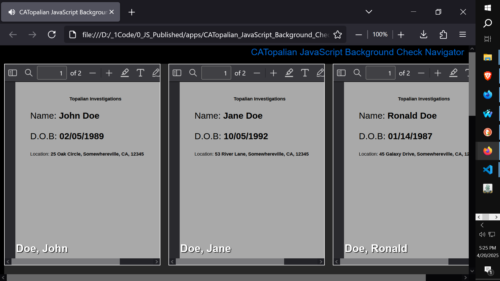

# CATopalian JavaScript Background Check Navigator
A JavaScript application that displays multiple PDF's with a Last and First Name Label at the bottom of each of the pdfs for easy navigating. This particular application was made to help investigators in investigations.  

---

### How to Download this App
1. Click the green Code Button on this github page
2. Choose Download ZIP
3. Save the Zip File
4. Extract All
5. Double click the HTML file to start the App

---

Happy Scripting :-)

